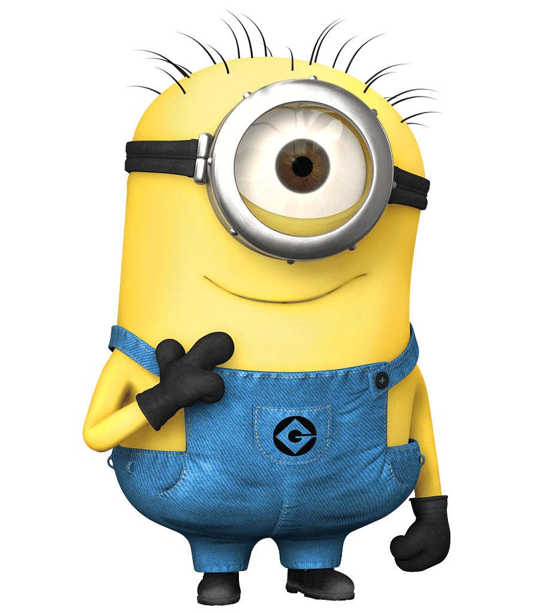
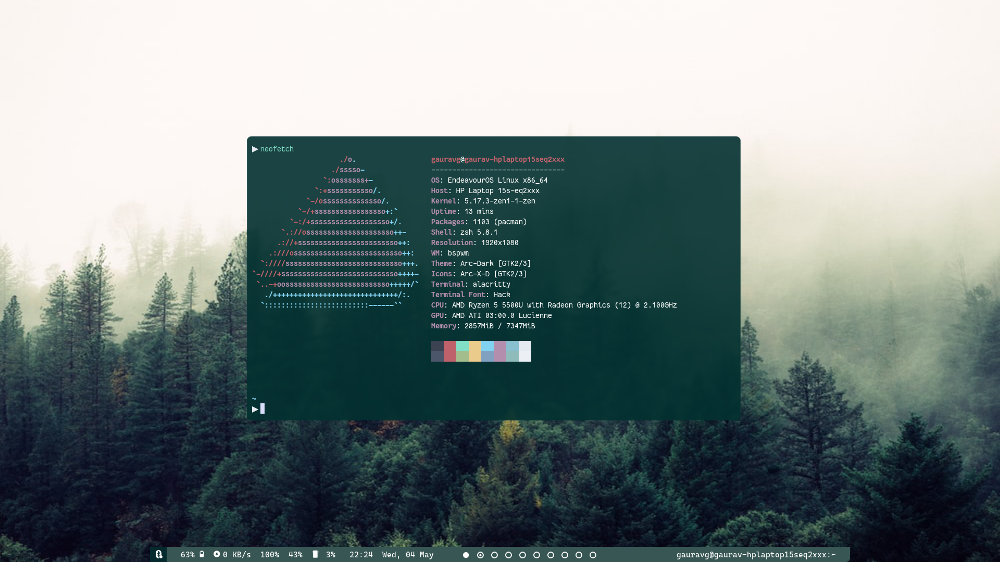

<h1 align="center">Hi 👋, I'm Gaurav Gupta</h1>
 

<h4> I’m currently learning FullStack Development & DSA.</h4>

Connect With Me 

Languages And Tools

 
 
 
 
    
    
    
    
    
    
    

 

 
Current rice

 
 
 

 
 

<table align="center">
  <tr>

  <td></td>
   
<td>
  </tr>  
</table>
<table align="center">
  <tr>

  <td>
  

  </td>
    </tr>

  </table>

